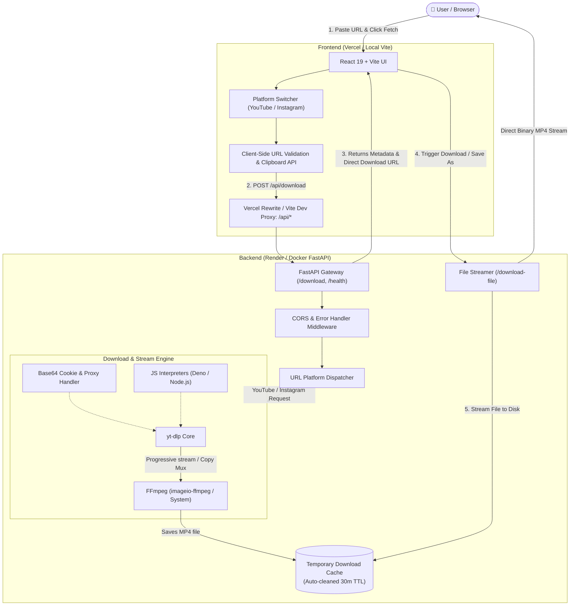

<div align="center">

# ⚡ SAVEALL — Pro Media Downloader

<p align="center">
  <strong>Ultra-Fast, Lossless & Cinematic All-in-One Media Downloader for YouTube & Instagram</strong>
</p>

<p align="center">
  <a href="#-key-features">Features</a> •
  <a href="#-system-architecture">Architecture</a> •
  <a href="#-tech-stack">Tech Stack</a> •
  <a href="#-project-structure">Project Structure</a> •
  <a href="#-local-development">Quick Start</a> •
  <a href="#-api-reference">API Docs</a> •
  <a href="#-environment-variables">Configuration</a> •
  <a href="#-deployment">Deployment</a> •
  <a href="#-creator--credits">Creator</a>
</p>

---

<!-- Badges -->
[](https://react.dev/)
[](https://vitejs.dev/)
[](https://www.python.org/)
[](https://fastapi.tiangolo.com/)
[](https://github.com/yt-dlp/yt-dlp)
[](https://ffmpeg.org/)
[](https://www.docker.com/)
[](https://render.com/)
[](https://vercel.com/)
[](LICENSE)

</div>

<br />

## 🌟 Overview

**SAVEALL** is a modern, full-stack media extraction application crafted with a **cinematic cyberpunk/dark-mode aesthetic** and powered by an industrial-grade **Python FastAPI** backend. It allows users to effortlessly download high-definition videos, reels, and shorts from **YouTube** and **Instagram** directly to their devices without annoying ads, shady popups, or quality degradation.

The frontend is built on **React 19** and **Vite**, featuring platform-reactive ambient backdrops, animated progress indicators, instant clipboard integration, and rich video metadata previews (title, author, duration, file size, thumbnail).

The backend utilizes **yt-dlp** with multi-threaded fragment downloads, progressive stream prioritization (`format: 22/18` or `-c copy` multiplexing for instantaneous packaging without heavy transcoding), multi-engine JavaScript runtime support (**Deno** + **Node.js**), and intelligent cookie / proxy fallback handling.

---

## ✨ Key Features

| Feature | Description |
| :--- | :--- |
| ⚡ **Blazing Fast Processing** | Progressive single-stream prioritization (`22/18`) and lossless stream-copy multiplexing (`-c copy`) delivers finished MP4 files in seconds. |
| 🎨 **Cinematic Dynamic UI** | Premium dark-mode interface with adaptive platform ambient glows (crimson red for YouTube, sunset purple-pink for Instagram). |
| 🎬 **Dual Platform Support** | Seamlessly handles **YouTube** (Videos, Shorts, Music) and **Instagram** (Reels, Posts, IGTV). |
| 📋 **One-Click Clipboard Actions** | Fast **Paste** button to automatically read copied video links, and **Copy Direct Link** for sharing or external download managers. |
| 🖼️ **Rich Metadata Previews** | Live video thumbnails, duration formatting (`HH:MM:SS`), creator attribution, and human-readable file sizes (`MB/GB`). |
| ⏳ **Multi-Stage Feedback** | Engaging real-time visual progress tracker with animated pulse beacons informing users of the exact download phase. |
| 🛡️ **Zero Ads & Privacy-First** | Direct media streaming with no trackers, third-party redirects, adware, or intrusive telemetry. |
| 🤖 **Anti-Bot & Challenge Bypass** | Integrated support for base64 Netscape cookies (`YOUTUBE_COOKIES_B64`, `INSTAGRAM_COOKIES_B64`), residential proxies, and **Deno/Node** JS engines. |
| 🧹 **Automated Storage Hygiene** | Automated disk cache cleanup: evicts files older than 30 minutes and cleans up aborted `.part`/`.temp` artifacts. |
| 🌐 **Production-Grade CORS** | Pre-configured CORS policies supporting local development ports, Vercel deployments, Render domains, and custom URLs. |

---

## 🏗️ System Architecture



---

## 🛠️ Tech Stack

### Frontend
- **Framework:** [React 19.2](https://react.dev/)
- **Build Tool:** [Vite 8.3](https://vitejs.dev/)
- **Styling:** Custom Vanilla CSS Design System (Cinematic Glassmorphism, CSS Variables, Fluid Typography, Micro-animations)
- **Linter:** [Oxlint](https://oxc.rs/)
- **Deployment Target:** [Vercel](https://vercel.com/)

### Backend
- **Framework:** [FastAPI 0.115+](https://fastapi.tiangolo.com/) (ASGI)
- **Server:** [Uvicorn 0.30+](https://www.uvicorn.org/)
- **Media Downloader:** [yt-dlp](https://github.com/yt-dlp/yt-dlp)
- **Media Transcoder:** [FFmpeg](https://ffmpeg.org/) via [`imageio-ffmpeg`](https://github.com/imageio/imageio-ffmpeg) & system fallback
- **JS Runtimes:** [Deno](https://deno.land/) & [Node.js](https://nodejs.org/) (for resolving YouTube signature challenges)
- **Data Validation:** [Pydantic v2](https://docs.pydantic.dev/)
- **Containerization:** [Docker](https://www.docker.com/) (Multi-stage build on `python:3.12-slim`)
- **Deployment Target:** [Render](https://render.com/)

---

## 📁 Project Structure

```text
saveall-main/
├── .env.example            # Environment variables blueprint
├── .gitignore              # Git ignore rules
├── .oxlintrc.json          # Oxlint configuration
├── .vercelignore           # Vercel deployment exclusions
├── index.html              # HTML5 entry template with SEO & OpenGraph meta tags
├── package.json            # Node.js dependencies and scripts
├── render.yaml             # Render infrastructure-as-code blueprint
├── test_suite.py           # Automated end-to-end Python test suite
├── vercel.json             # Vercel build configuration & API reverse-proxy rewrites
├── vite.config.js          # Vite config with React plugin and dev proxy
│
├── backend/                # Python FastAPI Backend
│   ├── Dockerfile          # Production Dockerfile (Deno + Node.js + FFmpeg + Python 3.12)
│   ├── main.py             # FastAPI server application, endpoints, and yt-dlp logic
│   └── requirements.txt    # Python backend dependencies
│
├── public/                 # Static assets
│   ├── favicon.svg         # High-resolution vector favicon
│   └── icons.svg           # Scalable SVG sprite library
│
└── src/                    # React Frontend
    ├── App.jsx             # Main application UI, platform switcher, download pipeline
    ├── App.css             # Cinematic styling, cyberpunk ambient glows, responsive layout
    ├── config.js           # Site branding, creator information, and social links
    └── main.jsx            # React root mount point
```

---

## 🚀 Local Development

### 1. Prerequisites
Ensure you have the following installed on your machine:
- **Node.js** (v18 or higher) & **npm**
- **Python** (v3.10 or higher) & **pip**
- **FFmpeg** (Recommended: installed on system or will be auto-resolved via `imageio-ffmpeg`)
- *(Optional)* **Deno** or **Node.js** in your system `PATH` for YouTube deciphering

---

### 2. Setup the Backend

Open a terminal and navigate to the project directory:

```bash
# 1. Create a Python virtual environment
python -m venv .venv

# 2. Activate the virtual environment
# Windows (PowerShell):
.venv\Scripts\Activate.ps1
# Windows (Command Prompt):
.venv\Scripts\activate.bat
# Linux / macOS:
source .venv/bin/activate

# 3. Install backend dependencies
pip install -r backend/requirements.txt

# 4. Start the FastAPI backend server
python -m uvicorn backend.main:app --host 127.0.0.1 --port 8000 --reload
```

The backend API is now running at `http://127.0.0.1:8000`. You can test it in your browser:
- API Home: [http://127.0.0.1:8000/](http://127.0.0.1:8000/)
- Swagger Interactive Docs: [http://127.0.0.1:8000/docs](http://127.0.0.1:8000/docs)
- Health Check: [http://127.0.0.1:8000/health](http://127.0.0.1:8000/health)

---

### 3. Setup the Frontend

In a separate terminal:

```bash
# 1. Install frontend packages
npm install

# 2. Launch the Vite development server
npm run dev
```

Vite will start at `http://localhost:5173`. 
> **Note:** The Vite dev server automatically proxies any requests starting with `/api` to your local FastAPI backend at `http://127.0.0.1:8000`, so no extra CORS configuration is required during local development!

---

## 🔌 API Reference

### Base URLs
- **Local:** `http://127.0.0.1:8000` (or proxied via `http://localhost:5173/api`)
- **Production:** `https://saveall-api.onrender.com`

---

### 1. Unified Download Endpoint

Automatically detects whether the URL is from YouTube or Instagram and initiates media processing.

- **URL:** `/download` or `/api/download`
- **Method:** `POST`
- **Content-Type:** `application/json`

#### Request Payload
```json
{
  "platform": "YouTube", // Optional: "YouTube", "Instagram", or leave empty for auto-detection
  "url": "https://www.youtube.com/watch?v=dQw4w9WgXcQ"
}
```

#### Success Response (`200 OK`)
```json
{
  "success": true,
  "status": "ready",
  "message": "YouTube video is ready to download.",
  "title": "Rick Astley - Never Gonna Give You Up (Official Music Video)",
  "url": "https://www.youtube.com/watch?v=dQw4w9WgXcQ",
  "platform": "YouTube",
  "file_name": "Rick Astley - Never Gonna Give You Up-dQw4w9WgXcQ.mp4",
  "download_url": "https://saveall-api.onrender.com/download-file?filename=Rick+Astley...",
  "thumbnail": "https://i.ytimg.com/vi/dQw4w9WgXcQ/maxresdefault.jpg",
  "duration": 213,
  "uploader": "Rick Astley",
  "filesize": 15482910
}
```

#### Error Response (`400 Bad Request`)
```json
{
  "success": false,
  "error": "This Instagram content is private or requires login. Only publicly accessible Instagram Reel/Post links can be downloaded.",
  "detail": "This Instagram content is private or requires login. Only publicly accessible Instagram Reel/Post links can be downloaded."
}
```

---

### 2. Platform-Specific Endpoints

- **YouTube:** `POST /api/download-youtube`
- **Instagram:** `POST /api/download-instagram`

Both accept `{ "url": "..." }` and return the standardized JSON payload.

---

### 3. File Streaming Endpoint

Serves the downloaded binary MP4 file with proper attachment headers for instant browser downloads.

- **URL:** `/download-file` or `/api/download-file`
- **Method:** `GET`
- **Query Parameter:** `filename` (e.g. `?filename=video-id.mp4`)
- **Response:** Binary Stream (`video/mp4` / `application/octet-stream`)

---

### 4. System Health & Diagnostics

- **Health Check:** `GET /health` or `GET /api/health`
  ```json
  { "success": true, "status": "healthy" }
  ```
- **Temp Storage Check:** `GET /download-folder` or `GET /api/download-folder`
  ```json
  { "success": true, "folder": "/tmp/saveall-downloads", "exists": true }
  ```

---

## ⚙️ Environment Variables

Configure these variables in your deployment environments or in a local `.env` file (see [`.env.example`](.env.example)):

### Frontend (`Vercel` / `.env`)
| Variable | Required | Description | Default |
| :--- | :---: | :--- | :--- |
| `VITE_API_URL` | No | Full URL of the production backend API. | `https://saveall-api.onrender.com` |
| `VITE_API_BASE_URL` | No | Alternate alias for `VITE_API_URL`. | *(Same as above)* |

### Backend (`Render` / Server Environment)
| Variable | Required | Description | Default |
| :--- | :---: | :--- | :--- |
| `FRONTEND_ORIGIN` | No | Primary allowed origin for CORS requests. | `https://saveall.vercel.app` |
| `FRONTEND_ORIGINS` | No | Comma-separated list of additional allowed frontend origins. | *(Empty)* |
| `PUBLIC_API_URL` | No | Canonical public HTTPS URL for generating download links. | Auto-detected from Host header |
| `PORT` | No | Port on which the FastAPI server listens. | `8000` (or `10000` on Render) |
| `DOWNLOAD_DIR` | No | File system path for caching downloaded video artifacts. | System temporary directory |
| `YOUTUBE_COOKIES_B64` | No | Base64-encoded `cookies.txt` file for YouTube bot bypass. | *(Empty)* |
| `INSTAGRAM_COOKIES_B64`| No | Base64-encoded `cookies.txt` file for restricted Instagram reels. | *(Empty)* |
| `YOUTUBE_PROXY` | No | Residential or rotating proxy URL (e.g., Webshare). | *(Empty)* |

> [!TIP]
> **How to create base64 cookies:**
> If you have a Netscape-formatted `cookies.txt` file exported from your browser:
> ```bash
> # Windows (PowerShell):
> [Convert]::ToBase64String([IO.File]::ReadAllBytes("cookies.txt"))
> 
> # Linux / macOS (Bash):
> base64 -w 0 cookies.txt
> ```
> Copy the output string and paste it into the `YOUTUBE_COOKIES_B64` environment variable.

---

## 🚢 Production Deployment

### 1. Deploy Backend on Render (Docker)
1. Fork or push this repository to GitHub.
2. Sign in to [Render](https://render.com/).
3. Click **New +** > **Blueprint** and connect your repository (Render will automatically pick up [`render.yaml`](render.yaml)).
   - Alternatively, choose **Web Service** > **Build and deploy from a Dockerfile**.
   - Set **Docker Context** to `backend` and **Dockerfile Path** to `backend/Dockerfile`.
4. Configure the environment variables (`FRONTEND_ORIGIN`, `PUBLIC_API_URL`, etc.).
5. Click **Create Web Service**.

---

### 2. Deploy Frontend on Vercel
1. Sign in to [Vercel](https://vercel.com/) and click **Add New...** > **Project**.
2. Select your repository.
3. Vercel will automatically detect **Vite** as the framework preset:
   - **Build Command:** `npm run build`
   - **Output Directory:** `dist`
4. Under **Environment Variables**, add:
   - `VITE_API_URL`: Your deployed Render API URL (e.g. `https://saveall-api.onrender.com`).
5. Click **Deploy**.
6. The included [`vercel.json`](vercel.json) automatically proxies `/api/*` requests to your Render service to prevent CORS and mixed-content issues!

---

### 3. Docker Local Run

You can build and test the production Docker container locally:

```bash
# Build the container
docker build -t saveall-api -f backend/Dockerfile backend

# Run the container on port 8000
docker run -p 8000:10000 -e PORT=10000 saveall-api
```

---

## 🧪 Testing & Validation

### Backend End-to-End Test Suite
A comprehensive testing script is included in [`test_suite.py`](test_suite.py) that validates:
- Backend process startup & health checks
- CORS preflight headers (`OPTIONS` with Origin checking)
- Input validation on malformed URLs
- End-to-end download flow for YouTube and Instagram

Run the test suite with:

```bash
python test_suite.py
```

### Frontend Linting
To check code quality and ensure zero lint issues:

```bash
npm run lint
```

---

## ❓ Troubleshooting & FAQs

<details>
<summary><strong>1. YouTube says: "Unable to process this YouTube link from the server"</strong></summary>

YouTube frequently blocks requests originating from datacenter IP addresses (like Render, AWS, DigitalOcean). To resolve this:
- Provide a base64-encoded Netscape cookie file via `YOUTUBE_COOKIES_B64`.
- Provide a residential or rotating proxy URL via `YOUTUBE_PROXY` (e.g., Webshare, Bright Data).
</details>

<details>
<summary><strong>2. Instagram downloads fail with "Private content or requires login"</strong></summary>

Instagram restricts access to private profiles, age-gated reels, and certain audio tracks. SAVEALL is designed for public reels, posts, and IGTV links. Supplying `INSTAGRAM_COOKIES_B64` helps access content that requires standard session authentication.
</details>

<details>
<summary><strong>3. Mixed Content Warning in Browser</strong></summary>

If your frontend is deployed on an HTTPS domain (e.g. `https://saveall.vercel.app`), your backend API **must also use HTTPS** (`https://saveall-api.onrender.com`). Browsers block HTTP requests from HTTPS sites. SAVEALL includes built-in safeguards to enforce HTTPS in production.
</details>

<details>
<summary><strong>4. Server Disk Space / Memory Exhaustion</strong></summary>

SAVEALL includes an automated garbage collection routine in `backend/main.py` that automatically purges video files older than 30 minutes and deletes incomplete `.part` / `.temp` files after failed download attempts.
</details>

---

## 👨‍💻 Creator & Credits

<div align="center">

Engineered & Designed with ❤️ by **Shashikant Raj**  
*Under the brand **SashiBitCode***

[](https://www.instagram.com/sashibitcode/)
[](https://www.linkedin.com/in/sashikant-raj)
[](https://github.com/sashibitcode)
[](mailto:sashibitcode@gmail.com)

</div>

---

## ⚖️ Disclaimer

This software is developed strictly for **educational and personal archival purposes**. Downloading copyrighted material without permission from the content owner may violate the platform's Terms of Service and applicable intellectual property laws. Please ensure you only download videos that you own, have express permission to use, or that are published under Creative Commons / public domain licenses.

---

<div align="center">
  <sub>© 2026 SAVEALL • All Rights Reserved • Built by Shashikant Raj (SashiBitCode)</sub>
</div>
